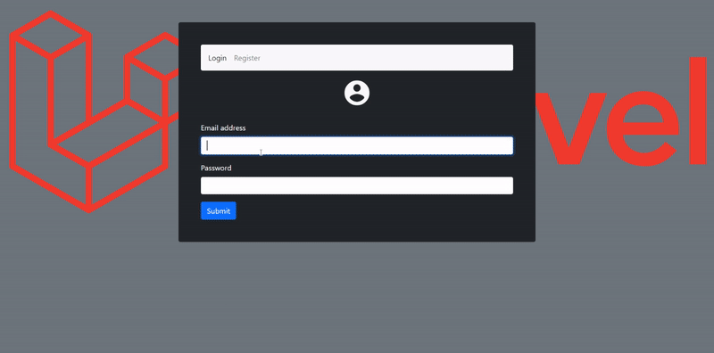

# Todo

	

Creating a new todo web application with Laravel.

This is my m-54 bootcamp class work project.

## Main features 
- Using Controllers
- Using middlewares
- Using Eloquent in Laravel
- Using laravel validation 
- Using laravel blade 
